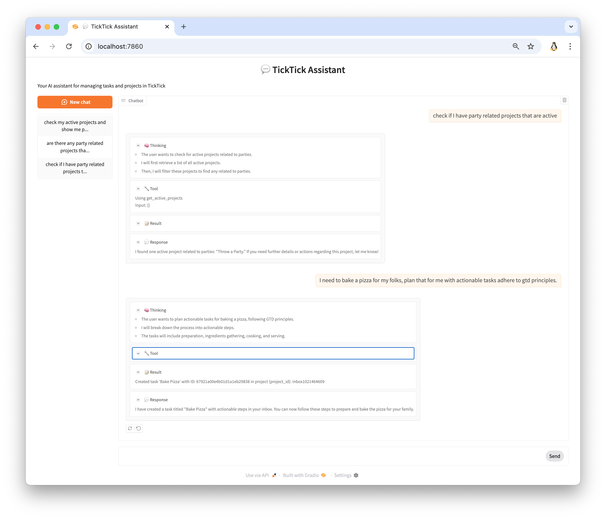
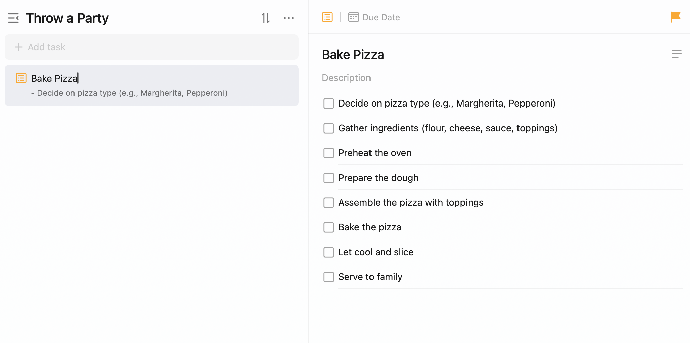

# Lang-TickTick

A chatbot interface for managing TickTick tasks and projects using natural language, built with LangChain and [Dida365](https://github.com/Cyfine/TickTick-Dida365-API-Client) package.


## Demo

The assistant can help you manage tasks and projects with natural language:
<p align="center">
  
</p>
<p align="center">
  
</p>

## Prerequisites

- Python 3.8+
- TickTick account
- OpenAI API key or compatible API endpoint
- TickTick developer account (for OAuth2 credentials)

## Setup

1. Clone the repository:
```bash
git clone https://github.com/Cyfine/Lang-TickTick.git
cd Lang-TickTick
```

2. Install dependencies using requirements.txt:
```bash
pip install -r requirements.txt
```


> **Warning**: Use Gradio version 5.13.0 and above as there is a bug in the chat interface for versions below 5.13.0.


1. Configure OAuth2 credentials:
   - Visit [TickTick Developer Portal](https://developer.ticktick.com/manage)
   - Create a new app by clicking "New App"
   - Add `http://localhost:8080/callback` as OAuth redirect URL
   - Save your Client ID and Client Secret

2. Create a `.env` file in the project root:
```env
# OpenAI Configuration
OPENAI_API_KEY=your_api_key_here
OPENAI_API_BASE=https://api.openai.com/v1  # Optional: custom endpoint
OPENAI_MODEL=gpt-3.5-turbo  # Optional: model selection

# Gradio Auth (optional)
GRADIO_USERNAME=your_username  # Optional: enable auth
GRADIO_PASSWORD=your_password  # Optional: enable auth

# TickTick/Dida365 Configuration
DIDA365_CLIENT_ID=your_client_id
DIDA365_CLIENT_SECRET=your_client_secret
DIDA365_REDIRECT_URI=http://localhost:8080/callback
DIDA365_SERVICE_TYPE=ticktick  # Use 'dida365' for Chinese version
```

## Running the Application

1. Start the web interface:
```bash
python app.py
```

2. Access the interface at:
```
http://localhost:7860
```

## Features

- Natural language task management through LangChain
- Full TickTick API integration via [dida365](https://github.com/Cyfine/TickTick-Dida365-API-Client)
- Project organization and task management
- Web-based chat interface using Gradio
- Conversation memory and context awareness


## Project Structure

- `app.py`: Gradio web interface and chat management
- `chat.py`: Core chatbot logic using LangChain
- `tools.py`: Tools for AI agents to use build upon dida365 package


## Credits

This project uses the [TickTick-Dida365-API-Client](https://github.com/Cyfine/TickTick-Dida365-API-Client) for TickTick API integration, which provides:
- Full async support
- OAuth2 authentication
- Type-safe API interactions
- Comprehensive error handling


